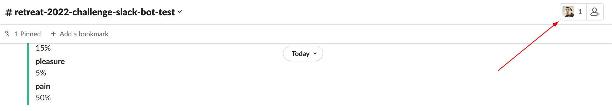
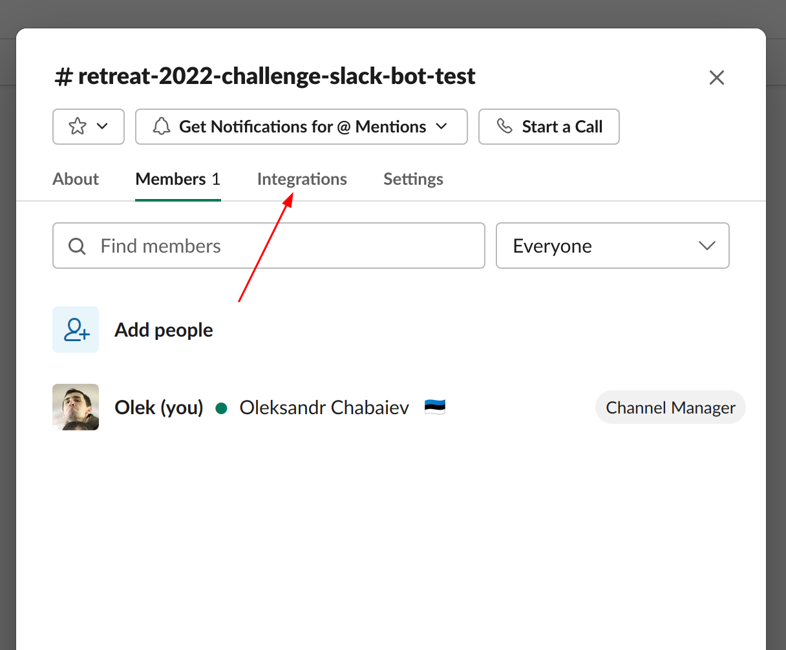
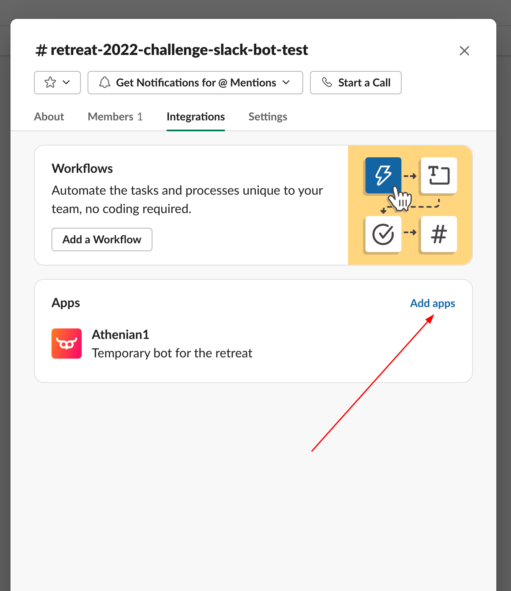
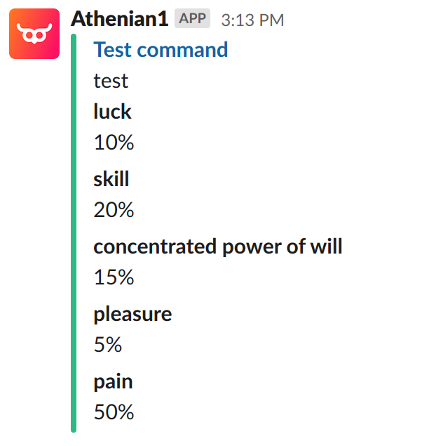

# retreat-challenge-slack-bot
[Jira issue](https://athenianco.atlassian.net/browse/DEV-5434)

## Intro

Welcome to the retreat 2022 hackaton. Please follow me!


The task is to implement the logic for our Slack bot that would:
- use some simple input string command 
- reach out to [Athenian API](https://api.athenian.co/v1/ui/#/) to acquire and compute some data that, in your opinion, could be 
useful or insightful for our everyday usage
- post-process the data and prepare a Slack message in a required format

You can do it in any language, but there's still some set of limitations.

## Preparation
### Docker

`Docker` has to be installed.

### Secrets
#### API token
To call the API let's use our personal _Bearer_ JWT tokens.

The token expires in 24 hours.

To get your personal token you have to:
1) revert god modes if you applied them before
2) login to Athenian [https://app.athenian.co](https://app.athenian.co/)
3) navigate to [https://app.athenian.co/bearer](https://app.athenian.co/bearer)
4) copy your _Bearer_ and save it somewhere locally

To test the _Bearer_ you can run something like this:
```bash
curl -X 'GET' \
  'https://api.athenian.co/v1/user' \
  -H 'accept: application/json' \
  -H 'Authorization: Bearer <your bearer here>'
```
It should return your Athenian user info.

This is exactly the same way you gonna auth to Athenian via your solution.

#### Slack token
Slack token is needed for debugging purposes just to validate that the message  you generated looks ok in Slack itself.

To get the slack token navigate to **Keeper**, then `Engineering/Retreat/Athenian1 - BOT token`.
Copy the token and save it somewhere locally.

### API
You will also need [API spec](https://api.athenian.co/v1/ui/#/) for obvious reasons.

### Slack
You need some playground to test the messages you generated.

Regarding channels, you can use pre-created `#retreat-2022-challenge-slack-bot-test`, or create a separate channel for
your team only:
- please create your channel with the prefix `#retreat-2022-hackaton` or `#retreat-2022-challenge`
- add your teammates
- add `Athenian1` slack application
  
  
  

## Solution
The solution can be submitted in any language, if it corresponds the following conditions.

### Input
The solution has to be a CLI, that receives a flag which 
is a "slack command"(imagine you received this string to your slack webhook).

The format of this command depends on your solution. If you plan, let's say, to print the cycle time of a time 
range you will need to pass and parse the argument with an interval or timestamps etc.

### Output
The output has to be a file in a JSON format. The spec is basically a simplified version of a Slack message API spec.

Here's the example:
```json
{
  "channel": "retreat-2022-challenge-slack-bot-test",
  "title": "Test command",
  "text": "test",
  "link": "https://cutt.ly/A1it7td",
  "color": "good",
  "fields": {
    "luck": "10%",
    "skill": "20%",
    "concentrated power of will": "15%",
    "pleasure": "5%",
    "pain": "50%"
  }
}
```
All fields are pretty much self-explanatory.

`color` can be either `good`, `warning` or `danger`.

Message example:



### Testing
To test the generated message you should just run this script:
```bash
./publish.sh ${path_to_your_message} ${slack_token}
```

### Examples
See [example-go](./cmd/example-go/main.go).

## Custom approach for 🐍
If you:
- want to provide a solution in Python
- feel yourself limited on functionality
- want to use more advanced Slack features

You can go with the following approach.

Navigate to **Keeper** `Engineering/Retreat`, then choose one of the bots `APP`, `BOT` and `SIGN` credentials of one of the 
apps(we have to negotiate teams and apps ownership to avoid conflicts) and run the following code:
```python
import os

import slack_bolt
from slack_bolt.adapter.socket_mode import SocketModeHandler

app = slack_bolt.App(
    token=os.getenv("BOT_TOKEN"),
    signing_secret=os.getenv("SIGN_TOKEN"),
)


@app.message("test")
def handle_message(message, say):
    say(os.getenv("SAY"))


if __name__ == "__main__":
    SocketModeHandler(app, os.getenv("APP_TOKEN")).start()
```
You can use it as a template and all you need is to implement `handle_message` function.

**Note:** if you have any problems with running this approach please contact @vmarkovtsev

This will allow you to test the bot directly with input and output commands.

Speaking of which, there's a couple of docs on message builders that you could use:
[layouts](https://api.slack.com/messaging/composing/layouts) and layout [blocks](https://api.slack.com/reference/block-kit/blocks).

---
That's it, GLHF!

<p align="center">
  
</p>
